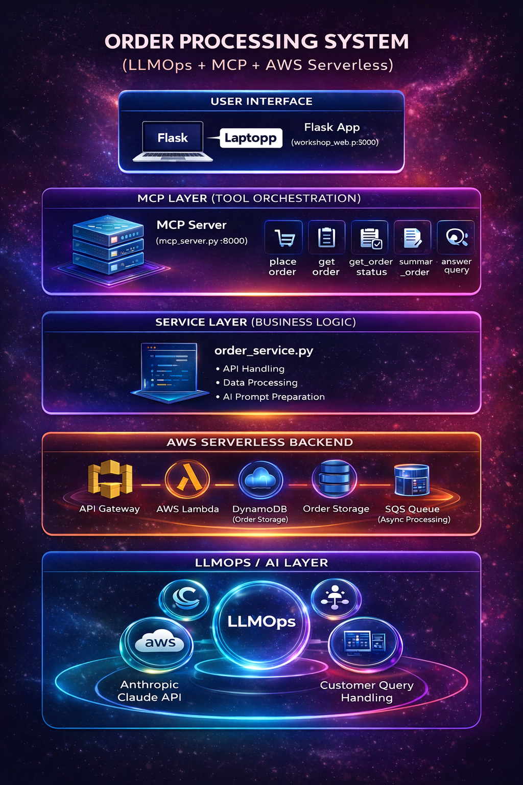

# Claude + MCP + AWS Order Assistant



This repository is a workshop-style demo that shows how a browser UI, an MCP server, AWS services, and Claude can work together in one practical order-support flow.

The project lets you:

- create orders from a local web UI
- send order creation requests through MCP tools
- store and update orders in AWS
- process queued orders with SQS and Lambda
- ask Claude customer-support questions about an order

## Architecture

The main pieces in this repo are:

- `web/web.py.py`
  Local Flask UI running on `http://127.0.0.1:3000`
- `mcp/mcp_server.py`
  MCP server that exposes tools over `stdio` or HTTP
- `mcp/order_service.py`
  Shared order logic for AWS access and Claude calls
- `terraform/`
  Infrastructure for API Gateway, Lambda, DynamoDB, and SQS
- `terraform/lambda/lambda_function.py`
  Lambda handler for order creation and SQS-based processing

## Architecture Diagram

```text
                    Browser UI
   ↓
Flask Web App
   ↓
MCP Server
   ↓
order_service.py
   ↓
API Gateway
   ↓
                +----------------------+
                |  SINGLE LAMBDA       |
                |  (lambda_function)   |
                +----------+-----------+
                           |
          ---------------------------------------
          |                                     |
          v                                     v
   DynamoDB (create order)              SQS Queue (send message)
                                             |
                                             v
                                   SAME LAMBDA AGAIN
                                 (triggered by SQS)
                                             |
                                             v
                              Process Order Update
                                             |
                                             v
                                      DynamoDB update
```

## Architecture Summary

- The browser interacts with the local Flask UI.
- The Flask UI sends all order and AI operations to the MCP server.
- The MCP server exposes tools and delegates logic to `order_service.py`.
- `order_service.py` talks to AWS for order operations and Anthropic for AI responses.
- AWS Lambda creates and processes orders using DynamoDB and SQS.

## End-to-End Flow

### 1. UI flow

1. The user opens the local UI at `http://127.0.0.1:3000`.
2. The UI provides three main actions:
   - create order
   - lookup order
   - ask AI about an order
3. The UI does not directly call AWS services.
4. Instead, it sends requests to the MCP server.

### 2. MCP flow

1. The MCP server receives tool requests from the UI.
2. It routes each request to the matching tool handler:
   - `place_order`
   - `get_order`
   - `get_order_status`
   - `summarize_order`
   - `answer_customer_query`
   - `get_workshop_config`
3. The MCP server delegates the actual business logic to `order_service.py`.

### 3. Order creation flow

1. The user submits an order in the UI.
2. The UI calls the MCP tool `place_order`.
3. `order_service.py` sends the request to the AWS API Gateway endpoint defined by `ORDER_API_URL`.
4. API Gateway invokes Lambda.
5. Lambda validates the payload and creates an order in DynamoDB.
6. The initial order is stored with values like:
   - `status = queued`
   - `paymentStatus = pending`
   - `shippingStatus = pending`
7. Lambda sends the order ID to SQS for background processing.
8. The success response returns to the MCP server and then back to the UI.

### 4. Background processing flow

1. SQS triggers Lambda asynchronously.
2. Lambda reads the order from DynamoDB.
3. Lambda updates the order to processed values such as:
   - `status = processed`
   - `paymentStatus = paid`
   - `shippingStatus = ready_for_dispatch`
4. The updated order is now available for lookup and AI responses.

### 5. Order lookup flow

1. The user enters an order ID in the UI.
2. The UI calls one of these MCP tools:
   - `get_order`
   - `get_order_status`
   - `summarize_order`
3. `order_service.py` reads the order from DynamoDB.
4. The MCP server returns either:
   - full order details
   - current status
   - human-readable summary

### 6. AI customer-support flow

1. The user asks a question such as `What is my order status?`
2. The UI calls the MCP tool `answer_customer_query`.
3. `order_service.py` loads the order from DynamoDB.
4. The order details and customer question are sent to Claude through the Anthropic API.
5. Claude returns a natural-language answer.
6. The answer is returned through the MCP server to the UI.

## Request Flow Summary

```text
Browser UI
  -> Flask Web App (port 3000)
  -> MCP Server (port 8000 in HTTP mode)
  -> order_service.py
  -> AWS API Gateway / DynamoDB / SQS / Lambda / Claude API
  -> response back to UI
```

## Project Structure

```text
.
|-- README.md
|-- mcp1.png
|-- mcp/
|   |-- .env
|   |-- mcp_server.py
|   `-- order_service.py
|-- web/
|   |-- requirements.txt
|   |-- web.py.py
|   |-- templates/
|   |   `-- index.html
|   `-- static/
|       |-- app.js
|       `-- styles.css
`-- terraform/
    |-- main.tf
    |-- output.tf
    |-- variable.tf
    |-- lambda.zip
    `-- lambda/
        `-- lambda_function.py
```

## Prerequisites

- Python 3.10+
- AWS account and configured credentials
- Terraform
- Anthropic API key

## Local Setup

### 1. Create and activate a virtual environment

```powershell
python -m venv .venv
.venv\Scripts\Activate.ps1
```

### 2. Install dependencies

```powershell
pip install -r web\requirements.txt
```

### 3. Configure environment variables

Update `mcp/.env` with your values:

```env
AWS_REGION=us-east-1
ORDERS_TABLE=Orders
ORDER_API_URL=https://your-api-id.execute-api.us-east-1.amazonaws.com/order
ANTHROPIC_API_KEY=your-key
CLAUDE_MODEL=claude-sonnet-4-20250514
MCP_TRANSPORT=http
MCP_HTTP_HOST=127.0.0.1
MCP_HTTP_PORT=8000
```

If your UI needs an explicit MCP URL, set:

```env
MCP_SERVER_URL=http://127.0.0.1:8000
```

## Run the Project

### 1. Start the MCP server

HTTP mode:

```powershell
python mcp\mcp_server.py --http
```

Or use `MCP_TRANSPORT=stdio` if connecting from an MCP client over standard input/output.

### 2. Start the web UI

Open a second terminal and run:

```powershell
python web\web.py.py
```

### 3. Open the UI

Go to:

```text
http://127.0.0.1:3000
```

## MCP Tools Exposed

The MCP server exposes these tools:

- `place_order`
- `get_order`
- `get_order_status`
- `summarize_order`
- `answer_customer_query`
- `get_workshop_config`

## Terraform Infrastructure

From the `terraform/` folder:

```powershell
terraform init
terraform apply
```

This provisions the AWS resources used by the demo, including:

- API Gateway
- Lambda
- DynamoDB
- SQS

After deployment, make sure `ORDER_API_URL` in `mcp/.env` matches the created API endpoint.

## Typical Demo Walkthrough

1. Start the MCP server.
2. Start the Flask UI.
3. Create an order from the browser.
4. Verify the order is stored with `queued` status.
5. Let SQS and Lambda process the order.
6. Check the order status or summary from the UI.
7. Ask Claude a customer-style question about the order.

## Notes

- The web UI and MCP server are separate processes.
- `web.py.py` runs on port `3000`.
- `mcp_server.py` runs on port `8000` in HTTP mode.
- The UI talks to the MCP server, and the MCP server talks to AWS and Claude.

## Security Reminder

- Keep `.env` files private and out of version control.
- Rotate any API key that has been exposed.
- Do not commit generated Terraform state or packaged secrets.
